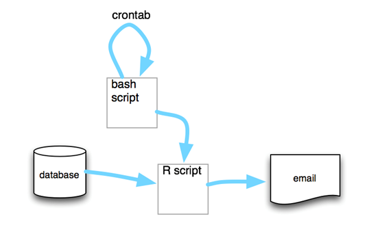

> ## 학습 목표 {.objectives}
>
> * 데이터 제품 사업 모형을 이해한다. 
> * 데이터 제품 개발 팀과 프로세스를 구성한다.
> * 데이터 제품을 제공할 웹 아키텍쳐를 이해한다.

### 1. 데이터 제품 사업 모형

Yasmin Lucero는 [UseR! 2014 컨퍼런스](http://user2014.stat.ucla.edu/)에서 R을 사용해서 사업화하는 방식에 대해 내부 제품과 외부 제품으로 나누어서 발표하였다.

#### 1.1. 내부 제품(Internal Product)  
 - 자료 분석 서비스 (one-off analytical product): 고객의 요구 사항에 기반하여 R을 사용해서 스크립트, 자료처리, 모형화, 그래픽과 문서를 제공하는 서비스 모형 [사례](http://rpubs.com/nathanesau1/21383
)
 - 보고서 자동화 (automated repots) : R + bash + email 혹은 R + markdown + web server와 같은 방식으로 `자료 분석 서비스`와 유사하나 이를 스크립트로 작성하고 crontab과 bash script를 사용하여 변경되는 데이터에 대해 자동으로 보고서를 산출하여 전자우편이나 웹에 전달
 
 - 내부 R 패키지 (Internal R Package) : 공개되는 R 패키지와는 다르게 내부적으로 개발되는 R 패키지로 일종의 소프트웨어 제품으로 볼 수 있다.
    - 데이터 API
    - 특정 비즈니스 측정값 (Business Specific Metrics)
    - 주문형 그래프(Ploat) 함수 (Custom Plotting Funcion)
    - 주문형 데이터 조작 유틸리티 (Custom data manipulation utilities)
 - 내부 대쉬보드 (internal dashboard) : EIS(Executive Information System)과 같이 데이터 분석 결과를 한 눈에 볼 수 있도록 대쉬보드 형태로 정리함.

#### 1.2. 외부 제품(External Product)  
 - B2C 형태 웹앱 (customer facing web app) : 인터랙티브 웹 형식으로 고객이 제품을 직접 사용할 수 있는 제품형태로 배포함. [사례: 맥킨지](http://www.showmeshiny.com/)
 - 분석 엔진 (analytical back-end) : 분석 엔진 소프트웨어 제품형태로 만들어서 판매 [사례: card.com](https://www.card.com/)

### 2. 데이터 제품 개발 팀

> ### 스티브 잡스의 제품 디자인이란? {.callout}
>
> In the documentary The  Lost  Interview, Steve  Jobs  said  this  about design: 
> “Designing a product is keeping five thousand things in your brain and fitting them all together in new and different ways to get what you want. 
> And every day you discover something new that is a new problem or a new opportunity to fit these things together a little differently. And it’s that process that is the magic.” 
>

#### 2.1. 데이터 과학자 및 팀 역량

데이터 과학자가 갖추어야할 역량은 컴퓨터 과학, 수학/통계학, 특정 분야 전문지식 외에 기계학습, 소통 및 발표기술, 데이터 시각화등 다양한 역량이 필요하며, 콘웨이(Drew Conway)가 데이터과학 벤다이어그램으로 데이터과학 역량을 시각화하였다.

 - 컴퓨터 과학 (Computer science)
 - 수학 (Math) / 통계학 (Statistics)
 - 기계 학습 (Machine learning)
 - 특정 분야 업무지식 (Domain expertise)
 - 소통 및 발표 기술 (Communication and presentation skills)
 - 데이터 시각화 (Data visualization)

과거 통계학이 특정 분야 업무지식을 바탕으로 통계/수학적 기법을 적용하던 전통적인 접근방법에 프로그래밍이 특히 강조된다.

#### 2.2. 데이터 과학팀 역량

훌륭한 데이터 과학 제품을 개발하고, 마케팅/판매, 운영, 소통을 위한 종합적인 역량이 필요하다. 데이터 과학 제품을 개발하기 위해서 개발팀을 구성하는데 컴퓨터 공학 전문가, 수학/통계학 전문가, 그래픽 디자이너, 특정분야 전문가 등 다양한 사람이 필요하다. [Harlan Harris, Sean Murphy, Marck Vaisman][1]은 각 개인의 역량과 데이터 과학팀 역량을 시각화하였다.

[1]: Harlan Harris, Sean Murphy, Marck Vaisman, “Analyzing the Analyzers: An Introspective Survey of Data Scientists and Their Work”, O'Reilly, June 2013

> ## [The Agile Manifesto][2] {.callout}
>
> **Individuals and interactions** over processes and tools  
> **Working software** over comprehensive documentation  
> **Customer collaboration** over contract negotiation  
> **Responding to change** over following a plan  
>

[2]: Jurney, Russell. Agile Data Science: Building Data Analytics Applications with Hadoop. " O'Reilly Media, Inc.", 2013.

### 3. 데이터 제품

웹기반 데이터 제품은 기본적으로 클라이언트-서버 아키텍쳐를 가지고 있으며, 최상단에서 보게 되면 웹브라우져 클라이언트가 웹서버에 클라우드 인터넷을 통해서 요청을 하고 서비스를 제공받는 구조로 되어 있다.
특히, 웹서버쪽은 복잡성의 증가에 맞춰 UI를 담당하는 웹서버(Presentation Tier), 비즈니스 로직을 담당하는 앱서버(Logic Tier), 데이터를 저장하는 데이터베이스(Persistence Tier)로 구분되는 3-Tier 아키텍처를 갖는다. 3-Tier 아키텍처를 갖춤으로써 **확장성(스케일링, Scaling)** 에 큰 강점을 갖추게 되었다.

HTML과 CSS로 UI쪽 프론트엔드(Frontend)를 담당하고, 중간 비즈니스 로직 처리 분야는 점증하는 복잡성에 대응하기 위해 MVC(Model-View-Controller) 디자인 패턴을 따르고, 마지막 MySQL 혹은 MariaDB 로 구현되는 데이터베이스 부분이 마지막으로 위치하게 된다.

#### 3.1. 데이터 제품 개발 및 운영 프로세스

데이터 제품 개발 순서는 2단계 (Two-Phase) 모형으로 첫번째가 데이터 제품 개발(Development), 두번째가 데이터 제품 운영(Operations)단계로 나눌 수 있다.

1. 제품 개발 단계
    - 자료 수집 (Collecting data)
    - 자료 저장 (Storing data)
    - 자료 처리 (Processing data)
2. 제품 운영단계 
    - 자료 배포 (Publishing data)
    - 자료 상품화 (Decorating data)

이벤트는 다양한 형식으로 생성되는데 센서, 금융 거래, 응용프로그램 사용자 이력, 서버 로그 등이 포함된다. 이벤트를 통해서 생성된 원자료는 수집기(Collector)를 통해서 대용량 저장소, 실시간 스트리밍 데이터 큐로 채집된다. 대용량 저장소는 물리적 저장 위치로 아마죤 S3, 소프트웨어적으로는 하둡 분산 파일시스템(Hadoop Distributed FileSystem, HDFS)에 담겨진다. 하둡이 없었다면 오늘날 빅데이터는 아마 존재하기 어려웠을 것이다. 하둡에 담겨진 대용량 데이터를 처리한 다음 정제된 형태로 분산 문서 저장소에 담겨진다. MongoDB같은 NoSQL시스템을 사용해서 웹응용프로그램이나 다른 서버가 사용할 수 있는 형태로 보관되어 서비스를 제공한다. 응용서버는 Python/Flask나 Ruby/Sinatra 같은 경량 웹프레임워크를 사용해서 웹브라우져 요청이 있을 때 서비스를 제공한다.   

    

#### 3.2. R 데이터 제품 툴 체인(Tool Chain)

R언어로 데이터 제품을 만들기 위해서 세가지 툴을 준비해야 한다.  
1. [R](http://cran.r-project.org/) : 데이터 분석 엔진이며 자료분석 DSL로 생산성이 높은 데이터 제품 개발 사실상 표준(defacto standard)  
2. [RStudio](http://www.rstudio.com/) : `R` 기반 통합개발환경(IDE, Integrated Development Environment)   
3. [Shiny 서버](http://shiny.rstudio.com/) : `R` 과 `RStudio`로 반응형 웹응용프로그램 개발 및 운영 플랫폼.

